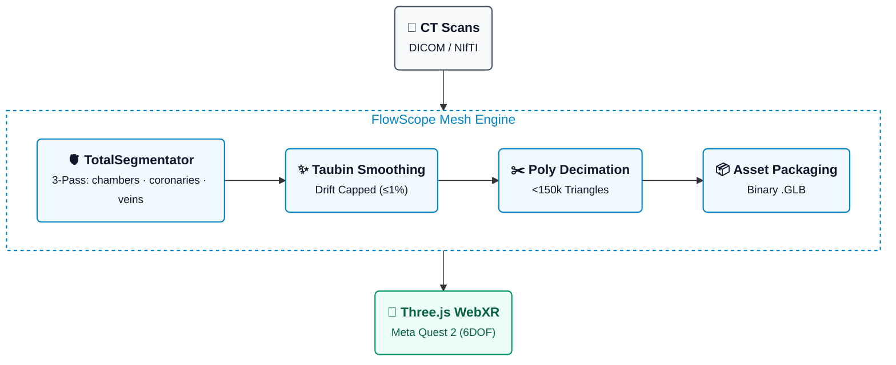

# FlowScope

> A pipeline that drags multi-gigabyte CT scans kicking and screaming into an untethered VR headset without turning a mobile Snapdragon into molten plastic.

**Zero native app builds • Zero Meta developer portals • Zero subscriptions required**


---

## What Actually Works

* **Headless Mesh Decimator (`pipeline/build_cardiac_glb.py`):** Runs Flying Edges extraction and Taubin smoothing without Blender — and tells the volume story straight. Measured over 355 real cardiac CT scans, per-structure Taubin drift is median 0.27%, IQR 0.18-0.45%, p95 0.57%, p99 1.02%; 206/355 cases exceeded 0.5% max-per-structure drift (dominated by the whole-heart envelope at a consistent ~0.55%). Plain verdict: "non-shrinking / no volume loss" does NOT hold strictly — smoothing systematically shrinks volume slightly (98.7% of structures, median -0.27%) — it holds only approximately/directionally for normal structures, and before the fix it failed outright (up to -100% volume) on degenerate small volumes. The pipeline now enforces **per-structure Taubin drift capped at 1% for watertight structures (measured)** via an iteration ladder (25→12→6→3→1 iters, else the raw Flying Edges mesh is kept unsmoothed): geometry is never discarded, and each structure reports its iters used plus capped/uncapped drift. One honest footnote: open FOV-truncated surfaces (641 rows) have no meaningful volume metric, so drift is unmeasured/uncapped there.
* **Stratified Poly Budgets:** Per-structure tier targets (myocardium 35–45k, great vessels ~30k, chambers 30–40k, coronaries 25–35k triangles) inside a hard 100k–150k scene window, with volume-preserving decimation and drift-capped Taubin smoothing.
* **Browser-Native WebXR Viewer (`viewer/`):** Three.js scene with 6DOF grab/rotate, two-handed scaling, per-structure and per-group visibility toggles (Myocardium Shell / Internal Chambers / Great Vessels / Coronary Tree), an opaque-PBR anatomical palette, and an interactive oblique MPR slice plane: a `THREE.Data3DTexture` (R8) CT slice with exactly one trilinear fetch per fragment, synchronized bidirectionally with hardware mesh clipping through a single authoritative `THREE.Plane` (Cross-section slider + VR thumbstick nudge to translate the cut along its normal, Axial/Coronal/Sagittal snaps, interactive Window/Level, VR grip-grab of the plane and a squeeze-held slicing wand). Co-registration rides one RAS-to-Three.js change of basis (meters, R→+X / A→−Z / S→+Y) baked into a compound `worldToVolume` uniform shared by the slice shader and the GLB. Live FPS / frame / GPU-time telemetry HUD included.
* **Zero-Sideload Delivery:** Served directly over local HTTPS to the Meta Quest Browser—no ADB installs or developer modes.

---

## Pipeline Architecture



---

## The Data (You Can't Render Thin Air)

* **Starter Coronary Meshes:** [ImageCAS on Kaggle](https://www.kaggle.com/datasets/xiaoweixumedicalai/imagecas?utm_source=gemini) — 1,000 pre-extracted vessel trees. Drop credentials in `~/.kaggle/` or use the env vars below.
* **Full Multi-Structure Heart (Ideal):** [AI-CVM/Cardiac-CT on Hugging Face](https://huggingface.co/datasets/AI-CVM/Cardiac-CT?utm_source=gemini) — 14 structures (chambers + coronaries). Gated; click "Request Access" on HF and wait for approval.
* **Raw DICOM / NIfTI Volumes:** Run any clean contrast volume through `tools/run_heartchambers.py` — the 3-pass TotalSegmentator recipe (`heartchambers_highres`, `coronary_arteries`, and a great-veins `--roi_subset` pass) lands discrete labels per structure, chamber type before lateral side (`heart_ventricle_left`, not `heart_left_ventricle`).

---

## Quickstart

### 1. Environment & Auth

```bash
pip install pyvista vtk totalsegmentator huggingface_hub kaggle

export KAGGLE_USERNAME="your-username"
export KAGGLE_KEY="your-api-key"
export HF_TOKEN="hf_your_token_here"

```

**TotalSegmentator academic license (required — `heartchambers_highres` won't run without one):** grab a free non-commercial key (`aca_…`) at <https://backend.totalsegmentator.com/license-academic/>, then register it once. `totalseg_set_license` is **not** a global command — it lives only in the Python env where `totalsegmentator` was installed (the project's `.venv` here), so activate that env first or call it by full path:

```bash
source .venv/bin/activate
totalseg_set_license -l aca_XXXXXXXXXXXXXX
# without activating: .venv/bin/totalseg_set_license -l aca_XXXXXXXXXXXXXX
# → "License has been successfully saved."  (the key is validated online)
```

One-time setup: the key lands machine-wide in `~/.totalsegmentator/config.json`, so every later `TotalSegmentator -ta heartchambers_highres …` run (including `tools/run_heartchambers.py`) finds it with no `-l` flag.

### 2. Crunch the Meshes

```bash
# 3-pass TotalSegmentator extraction per case (chambers/ + coronaries/ + veins/):
#   1) -ta heartchambers_highres   2) -ta coronary_arteries
#   3) default total task with --roi_subset superior_vena_cava inferior_vena_cava --fast
# Runs the passes sequentially (TotalSegmentator model downloads share one temp file).
python tools/run_heartchambers.py s0011

# Build the GLB: heartchambers_highres output wins over coarser masks for shared
# ids; the whole-heart `heart` envelope is kept as the visible outer anchor
# alongside `heart_myocardium` (LV wall inner shell).
python pipeline/build_cardiac_glb.py \
    --ts-dir data/segmentations/s0011 data/raw/totalseg_ct/s0011/segmentations \
    --output viewer/models/s0011.glb --report out/report_s0011.json

# MPR mode: give it the case root (CT + masks) and it also bakes the quantized
# CT volume pair beside the GLB — <case>_volume.bin (256^3 uint8, cardiovascular
# HU window -150..+450) + <case>_meta.json (dimensions/spacing/origin/affine plus
# the GLB recenter anchor for sub-mm slice/mesh co-registration).
python pipeline/build_cardiac_glb.py \
    --input data/case_01 \
    --output viewer/models/case_01.glb --report out/report_case_01.json

# No gated data at hand? Generate a synthetic contrast-CT sample case first:
python tools/make_sample_case.py            # writes data/case_01/ (CT + 15 masks)
```

### 3. Run the Viewer

```bash
cd viewer
npm ci
npm run build        # dist/ ships models/ (viewer/public/models -> ../models)
npm run cert         # throwaway self-signed cert into viewer/certs/
npm run serve:https  # serves dist/ + /models/ on https://0.0.0.0:8443

```

Put on the headset, browse to `https://<YOUR-LAN-IP>:8443`, bypass the self-signed cert warning, and hit **Enter VR**.

---

## What’s Missing (Because Reality Got in the Way)

* **Physical Quest 2 FPS Receipts:** Staged and ready, but someone actually has to put the plastic box on their face and log the 72–90 FPS telemetry.
* **14-Structure Dataset Access:** The Hugging Face repo is still throwing 403s while we wait for an author to click "approve".
* **Legal Reality:** The upstream datasets use non-commercial research licenses (CC BY-NC / BY-NC-ND), so don't try billing clients for this yet.

---

## Phase 2: Fluid Dynamics (When Anatomy Isn't Enough)

Because static geometry is too easy, the next step is bolting advection-diffusion scalar transport on top without melting the browser:

$$\frac{\partial C}{\partial t} + \mathbf{u} \cdot \nabla C = D \nabla^2 C$$

Expect 1D centerline network reductions via `svZeroDSolver`/`openBF` and synthetic AI surrogate operators (GINO/Transolver) before anyone attempts full CFD on a battery-powered headset.
