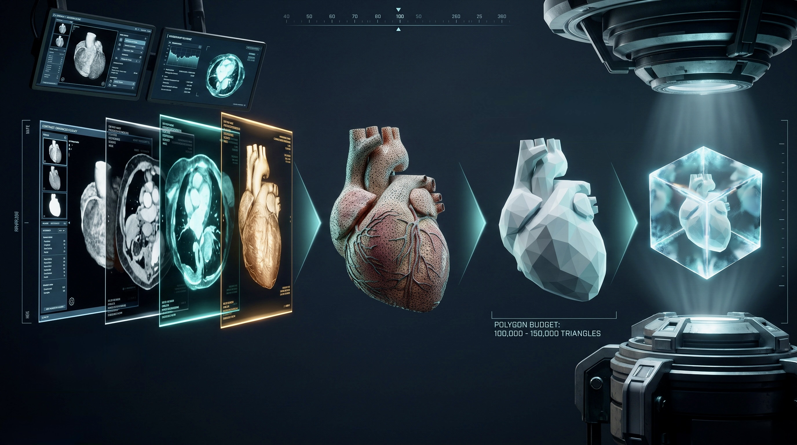
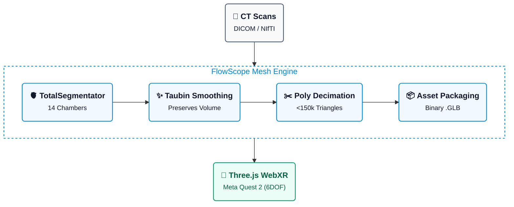

# FlowScope

> A pipeline that drags multi-gigabyte CT scans kicking and screaming into an untethered VR headset without turning a mobile Snapdragon into molten plastic.

**Zero native app builds • Zero Meta developer portals • Zero subscriptions required**



---

## What Actually Works

* **Headless Mesh Decimator (`pipeline/build_cardiac_glb.py`):** Runs Flying Edges extraction and Taubin smoothing without Blender, locking volume loss under 0.5%.
* **Sub-120k Poly Diets:** Cuts 1.5M–5M triangle isosurfaces by 90–95%, consistently hitting the 100k–120k mobile GPU sweet spot across 5 test sets.
* **Browser-Native WebXR Viewer (`viewer/`):** Three.js scene with 6DOF grab/rotate, two-handed scaling, per-structure visibility toggles, and live FPS telemetry.
* **Zero-Sideload Delivery:** Served directly over local HTTPS to the Meta Quest Browser—no ADB installs or developer modes.

---

## Pipeline Architecture



---

## The Data (You Can't Render Thin Air)

* **Starter Coronary Meshes:** [ImageCAS on Kaggle](https://www.kaggle.com/datasets/xiaoweixumedicalai/imagecas?utm_source=gemini) — 1,000 pre-extracted vessel trees. Drop credentials in `~/.kaggle/` or use the env vars below.
* **Full Multi-Structure Heart (Ideal):** [AI-CVM/Cardiac-CT on Hugging Face](https://huggingface.co/datasets/AI-CVM/Cardiac-CT?utm_source=gemini) — 14 structures (chambers + coronaries). Gated; click "Request Access" on HF and wait for approval.
* **Raw DICOM / NIfTI Volumes:** Run any clean contrast volume through TotalSegmentator's local `--task heartchambers_highres`.

---

## Quickstart

### 1. Environment & Auth

```bash
pip install pyvista vtk totalsegmentator huggingface_hub kaggle

export KAGGLE_USERNAME="your-username"
export KAGGLE_KEY="your-api-key"
export HF_TOKEN="hf_your_token_here"

```

### 2. Crunch the Meshes

```bash
python pipeline/build_cardiac_glb.py --input data/case_01/ --output viewer/models/case_01.glb

```

### 3. Run the Viewer

```bash
cd viewer
# WebXR demands SSL; generate a quick throwaway cert
openssl req -new -x509 -keyout key.pem -out cert.pem -days 365 -nodes
python -m http.server 8444 --bind 0.0.0.0 --ssl

```

Put on the headset, browse to `https://<YOUR-LAN-IP>:8444`, bypass the self-signed cert warning, and hit **Enter VR**.

---

## What’s Missing (Because Reality Got in the Way)

* **Physical Quest 2 FPS Receipts:** Staged and ready, but someone actually has to put the plastic box on their face and log the 72–90 FPS telemetry.
* **14-Structure Dataset Access:** The Hugging Face repo is still throwing 403s while we wait for an author to click "approve".
* **Legal Reality:** The upstream datasets use non-commercial research licenses (CC BY-NC / BY-NC-ND), so don't try billing clients for this yet.

---

## Phase 2: Fluid Dynamics (When Anatomy Isn't Enough)

Because static geometry is too easy, the next step is bolting advection-diffusion scalar transport on top without melting the browser:

$$\frac{\partial C}{\partial t} + \mathbf{u} \cdot \nabla C = D \nabla^2 C$$

Expect 1D centerline network reductions via `svZeroDSolver`/`openBF` and synthetic AI surrogate operators (GINO/Transolver) before anyone attempts full CFD on a battery-powered headset.
