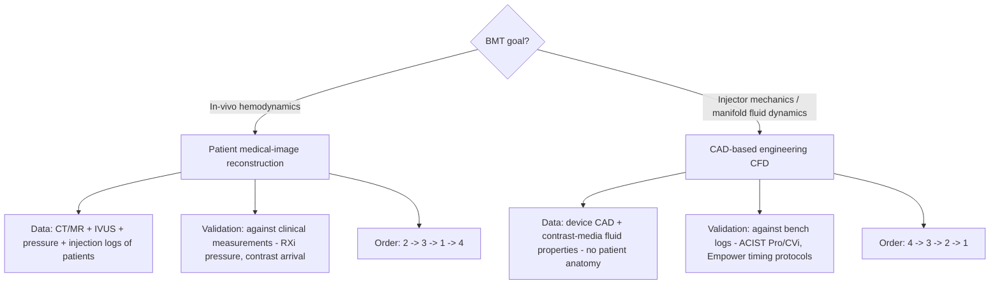

# BMT Value Comparison: Phase-1 Evidence → Phase-2 Pathways → Hardware Inputs

**Purpose.** Decision-grade comparison for the BMT stakeholder session: what the Phase 1
prototype already demonstrates against BMT's three stated value questions, which Phase 2
computational pathway each question implies, and which BMT/ACIST hardware would feed the
pipeline as measured inputs. Ends with the scoping fork (in-vivo hemodynamics vs. injector
mechanics), three discovery questions for the session, and a recommendation matrix.

**Evidence conventions.**
- *Demonstrated* = produced by the Phase 1 pipeline and inspectable in the artifacts cited below.
- *Brief-supplied* = hardware capability claimed by the BMT brief; **not independently verified**
  by us. Every hardware statement in this document is brief-supplied unless explicitly noted.
- Frame rates: measured desktop statistics exist via the viewer debug hook
  (`window.__XRVIEWER__`), but **Quest 2 headset FPS validation is still pending and must not be
  presented as validated**. No headset acceptance claims are made in this document.

---

## 0. Phase-1 evidence base (what actually exists)

| Artifact | Content | Key measured numbers |
|---|---|---|
| `out/coronary_601.glb` | ImageCAS case 601 coronary tree (binary label → surface) | 119,998 triangles; 1,261,272 B; surface volume 6,150.7 mm³ (`out/report_601.json`) |
| `out/coronary_700.glb` | ImageCAS case 700 coronary tree | 119,998 triangles; 1,261,268 B; surface volume 5,247.0 mm³ (`out/report_700.json`) |
| `out/coronary_798.glb` | ImageCAS case 798 coronary tree | 119,998 triangles; 1,261,176 B; surface volume 11,113.8 mm³ (`out/report_798.json`) |
| `out/cardiac_s0004.glb` | TotalSegmentator CT case s0004, 6 cardiac-mappable structures (heart, aorta, pulmonary veins, SVC, IVC, left atrial appendage) | 103,274 triangles total, all structures watertight (`out/report_s0004.json`) |
| `out/cardiac_s0015.glb` | TotalSegmentator CT case s0015, same 6-structure set | 119,994 triangles (`out/report_s0015.json`) |
| `viewer/` | three.js WebXR viewer, live at `https://192.168.1.229:8444/` (self-signed) | chamber/vessel navigation on real patient-derived geometry; `window.__XRVIEWER__` exposes fps, frameMs, triangles, drawCalls, camera/model debug |
| `pipeline/build_cardiac_glb.py` | reproducible segmentation→GLB pipeline | triangle budget 120,000 (window 100k–150k), smoothing + decimation with per-structure volume-drift reporting |

Provenance and license evidence per dataset is recorded in `data/manifest.json`
(ImageCAS: CC BY-NC 4.0 via Kaggle; TotalSegmentator CT via the TS remote fetcher).

**What this evidence is not.** It is not hemodynamics: no flow, pressure, or contrast-transport
quantity is computed in Phase 1. It is not clinical validation: segmentations are algorithmic
(TotalSegmentator masks, binary coronary labels) and surface volumes are reconstruction volumes,
not measurements. It is not a headset-validated VR demo: the viewer runs, interactivity and
geometry budgets are in place, but Quest 2 performance remains to be measured in session.

---

## 1. Q1 — Chamber / vessel structural navigation

### (a) Value claim and Phase-1 evidence

**Value claim.** Let a clinician or field specialist understand 3D chamber and vessel anatomy —
patient-specific or population-typical — in an immersive, navigable space: inspect coronary tree
course, chamber/vessel spatial relations, and device-relevant anatomy before or during a case,
replacing 2D slice-by-slice mental reconstruction.

**Phase-1 evidence (demonstrated).** This is the question Phase 1 answers most directly:
- Real patient coronary trees (ImageCAS 601/700/798) rendered as fully navigable 3D models
  (`out/coronary_601.glb`, `out/coronary_700.glb`, `out/coronary_798.glb`), each held to a
  120k-triangle budget with 100k–150k window compliance and per-structure volume-drift accounting
  (`out/report_*.json`).
- Six-structure cardiac context models (heart, aorta, pulmonary veins, SVC, IVC, left atrial
  appendage) in `out/cardiac_s0004.glb` / `out/cardiac_s0015.glb`, all watertight — i.e., the
  chamber/vessel relational anatomy the navigation claim needs, not just isolated vessels.
- A working WebXR viewer with model inspection and debug telemetry (draw calls, bbox, bindings),
  served over HTTPS for headset access (`viewer/serve-https.mjs`).

Remaining gaps for the claim: Quest 2 performance validation (pending), and anatomy fidelity —
binary coronary labels give tree shape but no lumen cross-section detail; that is exactly where
IVUS could later refine the model (see (c)).

### (b) Phase-2 pathway implication

Q1 is **anatomy-first**: its core is already delivered. Phase 2 adds *functional context on top
of the navigable anatomy*. Ranked fit of the four pathways:

| Pathway | Fit for Q1 | Effort / dependency notes |
|---|---|---|
| **3 — Decoupled Steady-State Transport** | **Primary** | Compute velocity field once over the cardiac cycle on the navigable geometry; re-solve only a contrast scalar per injection. Directly reuses Phase-1 surfaces as CFD domains; the cheapest way to overlay "how contrast would wash through this anatomy" onto the Q1 navigation scene. Depends on watertight surface quality (already demonstrated) + one CFD setup per anatomy. |
| **1 — Surrogate AI Operators (GINO/Transolver)** | Secondary | Once a solver + synthetic corpus (Track 4.1) exists, a neural operator can infer flow/pressure fields on new patient geometry in real time inside the viewer. Dependency: training corpus + solver from Pathway 2/3/4 work first; not a starting point. |
| **2 — 0D/1D Reduced-Order Networks** | Secondary | Centerline networks (svZeroDSolver/openBF) add transit times and arrival curves (ms) to the navigation story ("where does the injectate arrive, when"). Dependency: centerline extraction and network assembly from the same segmentations. |
| **4 — GPU-Accelerated LBM (OpenLB/HARVEY/FluidX3D)** | Negligible for Q1 | High-fidelity solver work buys little for a *structural* navigation claim; reserve as a reference/validation engine for Pathway 3 results. Cloud-GPU dependency and no local GPU on current host. |

### (c) Hardware feeds (all brief-supplied, not independently verified)

| Hardware (brief-supplied) | Stated capability (brief-supplied) | Role as Q1 pipeline input |
|---|---|---|
| **ACIST HDi / Kodama HD IVUS** | high-definition intravascular ultrasound → localized cross-sectional vessel geometry | **Primary feed.** Lumen cross-sections refine the coronary surfaces where binary labels are weakest (true lumen caliber, plaque-adjacent geometry), upgrading navigation fidelity from "tree shape" to "patient-specific caliber". |
| **ACIST RXi / Navvus MicroCatheter** | intravascular pressure measurement → physiological pressure gradients / boundary conditions | Secondary: pressure map layered onto the navigable anatomy as an annotation channel. |
| **ACIST Pro / ACIST CVi** | controlled contrast injection → flow rates, injection profiles, volume parameters | Contextual: injection profile attached to the navigation record so the anatomy view and the injection event are co-registered for later phases. |
| **EmpowerCTA+ / EmpowerMR** | radiology contrast delivery → peripheral and central injection timing protocols (radiology injectors distributed under Bracco's SmartInject / BraccoMR brands) | Weak for Q1: timing protocols only relevant if radiology (CT/MR) acquisition timing is part of the navigation reconstruction chain. |

---

## 2. Q2 — Downstream microvascular resistance modeling

### (a) Value claim and Phase-1 evidence

**Value claim.** Model the hemodynamic consequence of downstream microvascular resistance:
pressure gradients across stenoses/territories, flow splits, and contrast transit — supporting
physiological assessment (e.g., resistance as a boundary condition on observed epicardial disease)
rather than purely anatomical assessment.

**Phase-1 evidence (demonstrated — partial).** Phase 1 provides the *geometry substrate only*:
patient-specific coronary trees and cardiac structures, watertight and budget-compliant
(`out/coronary_601.glb`, `out/cardiac_s0004.glb`, `out/report_*.json`). It provides **no**
pressure, flow, resistance, or timing quantity — the Q2 value claim is unproven and is the
clearest Phase-2 build target. What Phase 1 de-risks: the reconstruction step (CT/MR mask → validated
surface) is solved, reproducible, and volume-audited, so Phase-2 solver work starts from ready domains.

### (b) Phase-2 pathway implication

| Pathway | Fit for Q2 | Effort / dependency notes |
|---|---|---|
| **2 — 0D/1D Reduced-Order Networks** | **Primary** | Microvascular resistance *is* a lumped-parameter question. svZeroDSolver/openBF centerline networks give pressure drops, flow splits, transit times and arrival curves at ms resolution — the exact output vocabulary Q2 names. Effort: centerline extraction from Phase-1 masks (must use in-scope tooling; VMTK is excluded), network assembly, microvascular resistance boundary models. Dependency: pressure/flow boundary data from ACIST feeds (below) to calibrate and validate. |
| **1 — Surrogate AI Operators** | Secondary → strategic | Synthetic-trained operators (GINO/Transolver) can amortize Q2 across many anatomies/parameters once a 0D/1D or CFD solver generates the training corpus (Track 4.1 `data/synthetic_corpus/`). Real-time inference is the differentiator for clinical workflow, but it is a second-generation deliverable dependent on Pathway 2 (or 3/4) existing. |
| **3 — Decoupled Steady-State Transport** | Secondary | Velocity-once / contrast-per-injection answers the *contrast arrival* half of Q2 (time-density curves) cheaper than transient CFD. It cannot give pulsatile pressure gradients; use it when the deliverable is arrival/timing rather than waveform physics. |
| **4 — GPU-Accelerated LBM** | Backfill (validation) | Resolves microvascular-scale or transitional physics that 0D/1D cannot; realistically used as a cloud-GPU reference solver to bound 0D/1D error, not as the per-patient path. Dependency: cloud GPU budget; no GPU on the current host. |

Effort note overall: Q2 is the heaviest Phase-2 item — it needs the synthetic corpus + at least one
full-order solver (3 or 4) to train/validate the reduced-order and surrogate layers, plus hardware
boundary-condition data we do not hold today.

### (c) Hardware feeds (all brief-supplied, not independently verified)

| Hardware (brief-supplied) | Stated capability (brief-supplied) | Role as Q2 pipeline input |
|---|---|---|
| **ACIST RXi / Navvus MicroCatheter** | intravascular pressure measurement → physiological pressure gradients / boundary conditions | **Primary feed.** Distal/proximal pressure gradients are the ground truth to calibrate microvascular resistance terms and validate predicted pressure drops. |
| **ACIST Pro / ACIST CVi** | controlled contrast injection → flow rates, injection profiles, volume parameters | **Primary feed.** Inlet flow-rate and volume waveforms are the inlet boundary conditions of the 0D/1D network; the known injection profile makes contrast-arrival predictions (Pathway 3) testable. |
| **ACIST HDi / Kodama HD IVUS** | high-def intravascular ultrasound → localized cross-sectional vessel geometry | Secondary feed: vessel cross-sections refine resistance-relevant lumen geometry (length, caliber) along the modeled segments. |
| **EmpowerCTA+ / EmpowerMR** | radiology contrast delivery → peripheral and central injection timing protocols (radiology injectors distributed under Bracco's SmartInject / BraccoMR brands) | Secondary feed: central vs. peripheral injection timing anchors the arrival-curve time origin when imaging-derived time-density curves are used for validation. |

---

## 3. Q3 — Injector mechanical profiling

### (a) Value claim and Phase-1 evidence

**Value claim.** Understand and optimize the *injector as a mechanical/fluid device*: injection
profiles, flow-rate control, pressure rise in the manifold/catheter path, contrast-media
delivery consistency — a device-engineering value proposition, distinct from patient hemodynamics.

**Phase-1 evidence (demonstrated — largely N/A).** The Phase-1 pipeline is patient
medical-image reconstruction; an injector/manifold is not patient anatomy. The only reusable
Phase-1 assets for Q3 are the **method assets**: the segmentation→validated-surface→budgeted-GLB
pipeline pattern, the volume-drift audit discipline, and the WebXR viewer as a generic 3D
inspection surface (it can display any GLB, including device CAD-derived geometry). The coronary
and cardiac GLBs themselves do **not** evidence Q3. This is the honest position for the session:
Q3 is a new workstream, not an extension of the demo — and the scoping fork (Section 4) exists
precisely because of this.

### (b) Phase-2 pathway implication

| Pathway | Fit for Q3 | Effort / dependency notes |
|---|---|---|
| **4 — GPU-Accelerated LBM (FluidX3D/OpenLB/HARVEY)** | **Primary** (CAD branch) | Manifold/injector internals = internal flows at device Reynolds numbers with moving boundaries/valves; LBM on cloud GPUs is the natural full-order engine. Effort: CAD acquisition + meshing/LBM setup, contrast-media fluid properties (viscosity, density — contrast media differ from blood/water). Dependency: cloud GPU access and device CAD files from BMT (not held today). |
| **3 — Decoupled Steady-State Transport** | Secondary | Good for steady operating points of the injector (constant flow-rate characterization, mixing of contrast and saline in the manifold when velocity is quasi-steady): solve velocity once, re-solve contrast scalar per injection recipe. Cheap sweep engine for profile comparison. |
| **2 — 0D/1D Reduced-Order Networks** | Secondary | Lumped circuit of the injector–manifold–catheter chain (compliance, resistance, inertia) gives fast profile/pressure predictions per commanded injection — ideal as the real-time model behind a profiling tool once parameters are identified from hardware logs or CFD. |
| **1 — Surrogate AI Operators** | Secondary (design sweeps) | After Pathway 4/3 generate training data over CAD parameter variations (orifice sizes, compliance), a surrogate supports rapid design-of-experiments. Dependency: solver data first. |

### (c) Hardware feeds (all brief-supplied, not independently verified)

| Hardware (brief-supplied) | Stated capability (brief-supplied) | Role as Q3 pipeline input |
|---|---|---|
| **ACIST Pro / ACIST CVi** | controlled contrast injection → flow rates, injection profiles, volume parameters | **Primary feed — the object of study.** Commanded vs. delivered flow-rate/profile/volume logs are both the boundary conditions for simulation and the validation targets for the mechanical model. |
| **EmpowerCTA+ / EmpowerMR** | radiology contrast delivery → peripheral and central injection timing protocols (radiology injectors distributed under Bracco's SmartInject / BraccoMR brands) | Primary feed on the radiology side: peripheral vs. central timing protocols define the operating envelope the profiling must characterize; note the Bracco SmartInject / BraccoMR distribution branding (brief-supplied) if portfolio scope is discussed. |
| **ACIST RXi / Navvus MicroCatheter** | intravascular pressure measurement → physiological pressure gradients / boundary conditions | Secondary: distal pressure during injection serves as the downstream load against which the injector model is checked (bench or in vivo). |
| **ACIST HDi / Kodama HD IVUS** | high-def intravascular ultrasound → localized cross-sectional vessel geometry | Negligible: catheter-tip lumen geometry only enters if catheter back-pressure through patient vessels is in scope — which is the *other* side of the fork. |

---

## 4. THE SCOPING FORK (first-class decision)

**The single most important decision for the BMT session is what "injector mechanics / manifold
fluid dynamics" means relative to "in-vivo hemodynamics."** These are different engineering
problems that happen to share vocabulary. Everything downstream — data sources, validation
strategy, Phase-2 pathway order — forks here.

| Dimension | Branch A: in-vivo hemodynamics (Q1/Q2 core) | Branch B: injector mechanics / manifold fluid dynamics (Q3 core) |
|---|---|---|
| **Geometry source** | Patient medical images: CT/MR segmentations (TotalSegmentator-class pipelines), refined by ACIST HDi/Kodama HD IVUS cross-sections (brief-supplied) | Device CAD: injector head, manifold, valves, catheter lumen. **No patient anatomy.** Patient vessels appear only, if at all, as a downstream lumped load. |
| **Fluid properties** | Blood (patient-varying) + contrast as a transported scalar | Contrast media as the working fluid: its viscosity/density/composition drive the mechanics; saline chasers and mixing matter |
| **Data sources** | ImageCAS-style coronary datasets for development; for clinical-grade work, paired case data: imaging + ACIST RXi/Navvus pressure + ACIST Pro/CVi injection profiles (brief-supplied capability; data-sharing agreement is a discovery question) | Device CAD from BMT; command + delivered logs from ACIST Pro/CVi and EmpowerCTA+/EmpowerMR timing protocols (brief-supplied); bench test rigs for pressure taps |
| **Validation** | Against physiological measurements: pressure gradients (RXi/Navvus, brief-supplied), contrast arrival/timing curves vs. imaging (Empower timing, brief-supplied). Acceptance bar: clinical plausibility + measurement agreement | Against bench measurement: delivered flow-rate/volume/profile vs. commanded, pressure at taps, timing repeatability. Acceptance bar: engineering tolerance on device characterization |
| **Phase-2 pathway order** | **2 → 3 → 1 → 4**: 0D/1D networks first (resistance/timing are the Q2 outputs and the cheapest validated step), decoupled transport for contrast arrival, surrogate for real-time, LBM as cloud-GPU reference | **4 → 3 → 2 → 1**: full-order LBM on the CAD domain first (device physics is the product), decoupled transport for per-recipe contrast sweeps, lumped 0D model extracted for real-time profiling, surrogate over design parameters |
| **What Phase 1 contributes** | Directly: the reconstruction pipeline + navigable anatomy (Q1 evidence) | Only method reuse: surface-validation discipline, GLB budgeting, viewer as a generic 3D inspection surface. No Phase-1 anatomy artifact is an input |
| **Hardware feeds that matter** | RXi/Navvus (BCs + validation), HDi/IVUS (geometry), Pro/CVi (inlet profiles) | Pro/CVi and EmpowerCTA+/EmpowerMR (the devices under characterization), RXi/Navvus as downstream load |
| **Risk if fork mis-resolved** | Building a manifold CFD tool nobody uses for patient decisions | Building a hemodynamics stack when BMT wanted device characterization — wasted corpus/solver investment |

Note the branches are composable: Branch B deliverables (injector profile models) can later
become the *inlet boundary condition generator* for Branch A. But they must be sequenced by which
one BMT will pay for and validate first — that is discovery question 1.

---

## 5. Three discovery questions for the BMT session

1. **Which side of the fork is the funded deliverable — and what is the acceptance artifact?**
   "Understand injection parameters" (Branch B: device CAD + bench validation, injector profile
   report) or "predict patient hemodynamics" (Branch A: patient models + measurement agreement)?
   If both: which one must be demo-able first? *(Everything in Section 4 — data, validation,
   pathway order — hinges on this answer.)*

2. **What paired data can BMT actually release, in what form?** Specifically: can we obtain, for
   the same cases/procedures, (i) device CAD of the relevant injector/manifold, (ii) ACIST Pro /
   ACIST CVi command + delivered logs (flow rates, injection profiles, volume parameters), (iii)
   ACIST RXi / Navvus pressure traces, (iv) ACIST HDi / Kodama HD IVUS pullbacks — and what are
   the de-identification, regulatory, and file-format constraints? *(All capabilities above are
   brief-supplied; availability of the *data* is unconfirmed and gates calibration and validation
   of every Q2/Q3 model.)*

3. **What does BMT count as validation, and at what latency?** Bench tolerance for device
   characterization (Branch B) vs. agreement with pressure/arrival measurements for physiological
   models (Branch A); and does the deliverable need interactivity (per-injection seconds, viewer
   real-time) or offline batch (minutes-to-hours acceptable)? *(Sets whether Pathway 1/2 fast
   inference is a requirement or a later optimization, and whether cloud-GPU Pathway 4 runs are
   admissible.)*

---

## 6. Recommendation matrix (Q × pathway × hardware feed)

Ratings: **P** = primary pathway for this question · **S** = secondary/strategic ·
**B** = backfill/validation only · **–** = negligible fit. Hardware feeds are brief-supplied
(not independently verified).

| Question | P1 — Surrogate AI Operators (GINO/Transolver) | P2 — 0D/1D Networks (svZeroDSolver/openBF) | P3 — Decoupled Steady-State Transport | P4 — GPU LBM (OpenLB/HARVEY/FluidX3D) | Primary hardware feeds (brief-supplied) |
|---|---|---|---|---|---|
| **Q1 structural navigation** | S — real-time field overlays on anatomy, once a solver corpus exists | S — transit/arrival annotations on the navigation view | **P** — cheapest functional overlay (velocity once, contrast per injection) on Phase-1 surfaces | B — reference solver only; little value for a structural claim | ACIST HDi / Kodama HD IVUS (lumen geometry refinement); RXi/Navvus (pressure annotations) |
| **Q2 microvascular resistance** | S → strategic — amortizes Q2 across anatomies in real time after corpus exists | **P** — resistance, pressure gradients, transit times, arrival curves (ms) are 0D/1D's native outputs | S — contrast arrival/timing half of Q2 without pulsatile physics | B — microvascular-scale reference to bound 0D/1D error (cloud GPU) | ACIST RXi / Navvus (pressure gradients / BCs + validation); ACIST Pro / CVi (inlet flow/injection profiles); HDi/IVUS (lumen geometry); EmpowerCTA+/EmpowerMR (timing protocols) |
| **Q3 injector mechanical profiling** | S — design-of-experiments sweeps after solver data | S — lumped injector–manifold–catheter model for real-time profile prediction | S — steady operating points and contrast mixing per recipe | **P** (CAD branch) — full-order device/manifold flow with contrast-media fluid properties | ACIST Pro / CVi (the device under study: flow rates, injection profiles, volume parameters); EmpowerCTA+ / EmpowerMR (peripheral/central timing protocols; radiology injectors distributed under Bracco's SmartInject / BraccoMR brands); RXi/Navvus (downstream load) |

**Pathway order, fork-conditional:** Branch A (in-vivo hemodynamics) — **2 → 3 → 1 → 4**.
Branch B (injector mechanics / manifold CFD) — **4 → 3 → 2 → 1**.

**Recommended session outcome:** resolve the fork (Q1 discovery), secure data commitment (Q2
discovery), fix the acceptance bar and latency target (Q3 discovery) — then commit to exactly one
branch's pathway order for Phase 2 and keep the other as the explicitly deferred follow-on.
